<p align="center">
  
</p>

<br />

I build **backend systems that stay calm under load** — event-driven services in Go, real-time messaging
over WebSocket and NATS, and the Vue + TypeScript consoles that operate them. I care about simple designs,
predictable latency, and code that is pleasant to change six months later.

```go
var Edison = Engineer{
    Role:  "Backend & Full-Stack Engineer",
    Core:  []string{"Go", "TypeScript", "Python", "Rust"},
    Focus: []string{
        "high-concurrency services",
        "real-time messaging",
        "protocol design",
        "admin platforms",
    },
    Motto: "Fix all. Ship fast.",
}
```

<br />

<picture>
  <source media="(prefers-color-scheme: dark)" srcset="./generated/stack-dark.svg" />
  
</picture>

<picture>
  <source media="(prefers-color-scheme: dark)" srcset="./generated/stats-dark.svg" />
  
</picture>

<picture>
  <source media="(prefers-color-scheme: dark)" srcset="./generated/heatmap-dark.svg" />
  
</picture>

<picture>
  <source media="(prefers-color-scheme: dark)" srcset="./generated/insights-dark.svg" />
  
</picture>

<br />

<p align="center">
  
</p>

<p align="center"><sub>Cards are rendered by <a href="./scripts/render.py"><code>scripts/render.py</code></a> every 12 hours · aggregate numbers only, no private code or repository names</sub></p>
