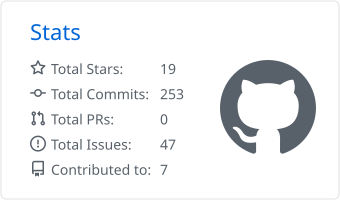
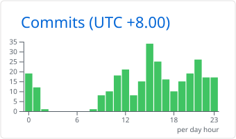
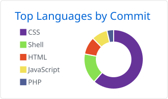
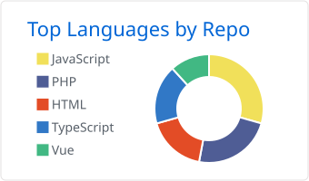

<!-- ============================ HEADER ============================ -->
<p align="center">
  
</p>

<p align="center">
  <a href="https://github.com/fixalllow"></a>
</p>

<p align="center">
  <a href="https://github.com/fixalllow?tab=followers"></a>
  
  
  
</p>

<br />

## 👨‍💻 About Me <sub><sup>关于我</sup></sub>

I'm a **backend-leaning full-stack engineer** who loves turning complex, high-throughput problems into
simple, reliable systems. Most of my days are spent in **Go** — designing event-driven services, real-time
messaging pipelines and the admin consoles that sit on top of them.

<sub>偏后端的全栈工程师，喜欢把复杂、高吞吐的问题拆解成简单可靠的系统。日常主要写 **Go**：设计事件驱动服务、实时消息链路，以及配套的管理后台。</sub>

```go
package main

type Engineer struct {
	Name      string
	Role      string
	Languages []string
	Focus     []string
	Motto     string
}

var Me = Engineer{
	Name:      "Edison",
	Role:      "Backend & Full-Stack Engineer", // 后端 / 全栈工程师
	Languages: []string{"Go", "TypeScript", "Python", "Rust", "Dart"},
	Focus: []string{
		"High-concurrency services",           // 高并发服务
		"Real-time messaging · WebSocket/NATS", // 实时通信
		"Protocol & data-pipeline design",      // 协议与数据链路设计
		"Admin consoles with Vue 3 + TS",       // 管理后台
	},
	Motto: "Fix all. Ship fast.", // 修好一切，快速交付
}
```

<table>
  <tr>
    <td width="50%" valign="top">

**🔭 What I do**

- ⚡ Event-driven backends in **Go** (Gin · NATS · MongoDB)
- 🔌 Real-time messaging over **WebSocket / Protobuf**
- 🖥️ Full-stack admin platforms with **Vue 3 + TypeScript**
- 🛠️ Ops-minded: **Linux · Nginx · CI/CD**

</td>
    <td width="50%" valign="top">

**🌱 我在做什么**

- ⚡ 用 **Go** 构建事件驱动后端（Gin · NATS · MongoDB）
- 🔌 基于 **WebSocket / Protobuf** 的实时通信
- 🖥️ **Vue 3 + TypeScript** 全栈管理平台
- 🛠️ 重视运维：**Linux · Nginx · CI/CD**

</td>
  </tr>
</table>

<br />

## 🧰 Tech Stack <sub><sup>技术栈</sup></sub>

<table align="center">
  <tr>
    <td align="center" width="170"><b>Languages</b><br /><sub>语言</sub></td>
    <td></td>
  </tr>
  <tr>
    <td align="center"><b>Backend</b><br /><sub>后端</sub></td>
    <td>
      <br />
      
      
      
      
    </td>
  </tr>
  <tr>
    <td align="center"><b>Frontend &amp; Mobile</b><br /><sub>前端 / 移动端</sub></td>
    <td></td>
  </tr>
  <tr>
    <td align="center"><b>Infra &amp; Tooling</b><br /><sub>运维 / 工具</sub></td>
    <td></td>
  </tr>
</table>

<br />

## 📊 GitHub Analytics <sub><sup>数据统计</sup></sub>

<p align="center">
  <picture>
    <source media="(prefers-color-scheme: dark)" srcset="./profile-3d-contrib/profile-night-rainbow.svg" />
    
  </picture>
</p>

<p align="center">
  <picture><source media="(prefers-color-scheme: dark)" srcset="./profile-summary-card-output/github_dark/3-stats.svg" /></picture>
  <picture><source media="(prefers-color-scheme: dark)" srcset="./profile-summary-card-output/github_dark/4-productive-time.svg" /></picture>
</p>
<p align="center">
  <picture><source media="(prefers-color-scheme: dark)" srcset="./profile-summary-card-output/github_dark/2-most-commit-language.svg" /></picture>
  <picture><source media="(prefers-color-scheme: dark)" srcset="./profile-summary-card-output/github_dark/1-repos-per-language.svg" /></picture>
</p>

<p align="center">
  <picture>
    <source media="(prefers-color-scheme: dark)" srcset="https://streak-stats.demolab.com?user=fixalllow&theme=github-dark-blue&hide_border=true&border_radius=10&locale=en&date_format=M%20j%5B%2C%20Y%5D" />
    
  </picture>
</p>

<br />

## 🐍 Contribution Snake <sub><sup>贡献贪吃蛇</sup></sub>

<p align="center">
  <picture>
    <source media="(prefers-color-scheme: dark)" srcset="https://raw.githubusercontent.com/fixalllow/fixalllow/output/github-snake-dark.svg" />
    
  </picture>
</p>

<details>
  <summary><b>📖 中文完整介绍（点击展开）</b></summary>
  <br />

你好，我是 **Edison**，一名偏后端的全栈工程师。

- **后端**：主力语言是 Go，常用 Gin、NATS、MongoDB，关注高并发、稳定性和可观测性。
- **实时通信**：熟悉 WebSocket 长连接、Protobuf 协议设计和事件驱动架构。
- **前端**：用 Vue 3 + TypeScript + Vite 搭建管理后台和数据看板。
- **其他**：也写 Python、Rust，用 Flutter 做跨平台尝试。

我相信好的系统应该「简单、可靠、可演进」。欢迎交流 👋

</details>

<br />

<p align="center">
  
</p>

<p align="center"><sub>⚙️ Stats & graphs auto-refresh every 12h via GitHub Actions · 数据每 12 小时由 GitHub Actions 自动刷新</sub></p>
