<p align="center">
  
</p>

<br />

I work on **instant messaging protocols** — how clients connect, how messages are framed, delivered and
acknowledged, and how state stays in sync across every device a user owns. Most of it lives in **Go**:
long-lived WebSocket connections, compact Protobuf wire formats and event-driven services on NATS, plus the
Vue + TypeScript consoles used to operate them.

```go
var Edison = Engineer{
    Role: "IM Protocol & Backend Engineer",
    Now:  "Designing instant messaging protocols",
    Focus: []string{
        "connection lifecycle & reconnection",
        "message delivery, ordering & acks",
        "multi-device state sync",
        "compact binary wire formats",
    },
    Stack: []string{"Go", "WebSocket", "Protobuf", "NATS", "Vue", "TypeScript"},
    Motto: "Fix all. Ship fast.",
}
```

<br />

<picture>
  <source media="(prefers-color-scheme: dark)" srcset="./generated/stack-dark.svg" />
  
</picture>

<picture>
  <source media="(prefers-color-scheme: dark)" srcset="./generated/activity-dark.svg" />
  
</picture>

<picture>
  <source media="(prefers-color-scheme: dark)" srcset="./generated/contributions-dark.svg" />
  
</picture>

<br />

<p align="center">
  
</p>

<p align="center"><sub>Cards are rendered by <a href="./scripts/render.py"><code>scripts/render.py</code></a> every 12 hours · aggregate numbers only, no private code or repository names</sub></p>
